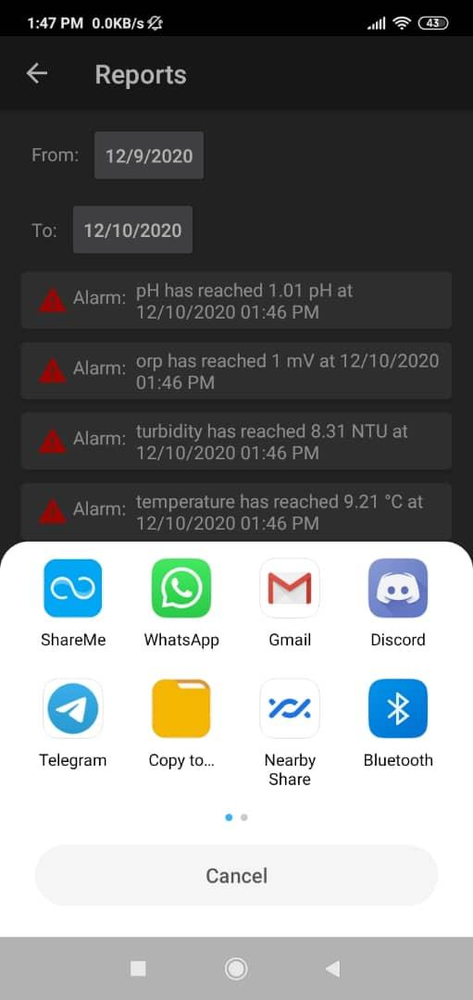

# App functionality

* The system connects to a user-based Firebase database and MQTT broker to receive data from an ESP8266 device that measures the pH, turbidity, ORP, and temperature of water samples via an internet connection.
* It displays water parameter levels in real-time.
* It shows graphs and charts of the water quality parameters over time and alerts the user when they exceed certain thresholds. These alerts are managed by an external service which sends push notifications and stores alarms in a database separate from Firebase.
* It generates reports of the water quality data and allows the user to export them in JSON format.

## Overall system

### App UML Activity Diagrams

## App sample of views

